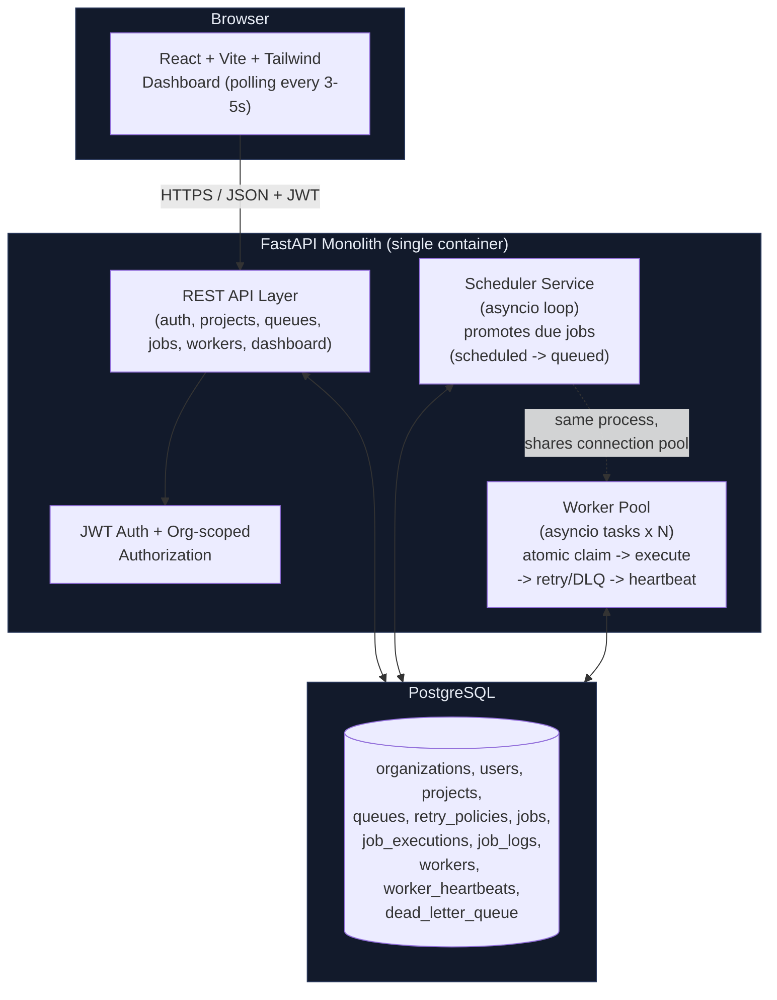
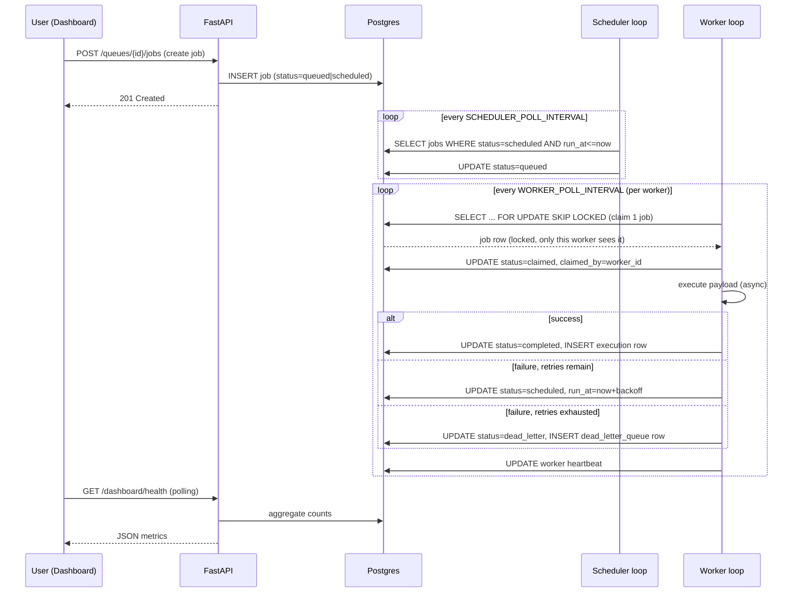

# Architecture Diagram

Orbit is a **monolithic** FastAPI application. The Worker Pool and Scheduler
are not separate deployables — they are asyncio background tasks started in
the same process via FastAPI's `lifespan`. This is a deliberate scope choice
for a 2-hour project (see `DESIGN_DECISIONS.md`): all the required
distributed-systems *concepts* (atomic claiming, concurrency limits,
heartbeats, graceful shutdown) are implemented for real, using
transaction-level Postgres locking — so the design scales to N real worker
containers with no code changes, just by running the worker loop in more
processes.

### Request/Execution flow

