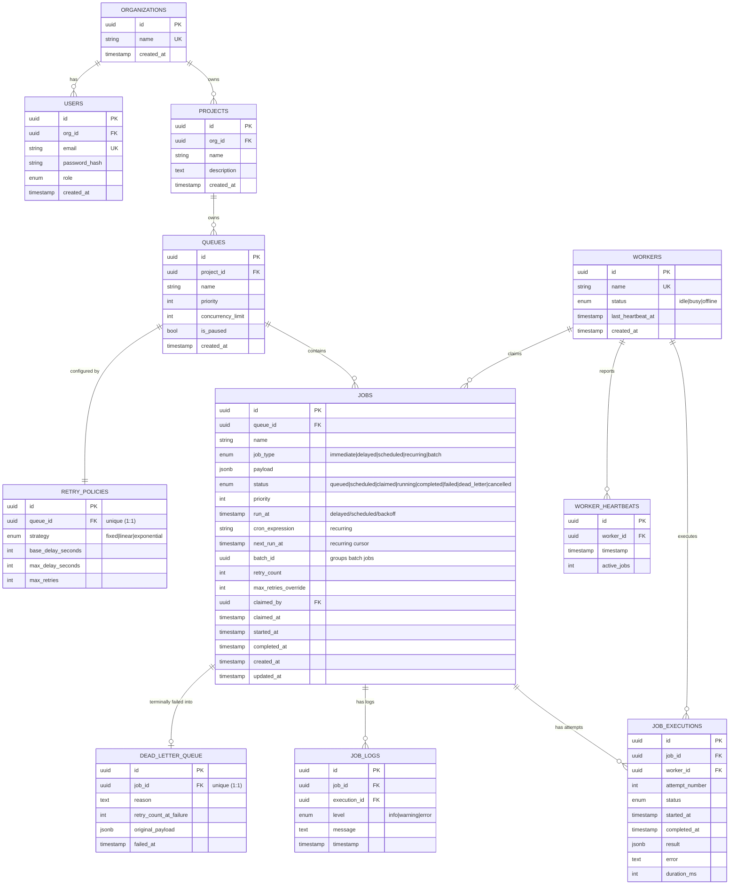

# Entity-Relationship Diagram

## Notes on normalization, keys, and cascading

- **Primary keys**: every table uses a UUID PK (`uuid4`, client/app-generated).
  This avoids sequential-ID contention across concurrent inserts from
  multiple workers and doesn't leak row counts through the API.
- **Foreign keys & cascade behavior**:
  - `organizations -> users/projects`: `ON DELETE CASCADE` — deleting a tenant
    cleans up everything it owns.
  - `projects -> queues`, `queues -> jobs`, `jobs -> job_executions/job_logs`,
    `jobs -> dead_letter_queue`: all `CASCADE` — child records are meaningless
    without their parent and we don't want orphaned rows.
  - `workers -> jobs.claimed_by` and `workers -> job_executions.worker_id`:
    `ON DELETE SET NULL` — a worker can be decommissioned without destroying
    the historical record of what it executed.
- **Normalization**: schema is in 3NF. `RetryPolicy` is split out as its own
  table (1:1 with `Queue`) purely to give it first-class identity per the
  assignment; `Job` intentionally denormalizes a `priority` copy from its
  queue at creation time so per-job overrides are possible without a queue
  join on every claim query.
- **"Scheduled Jobs" as an entity**: rather than a separate `scheduled_jobs`
  table, `Job` carries `cron_expression`/`run_at`/`next_run_at` directly. A
  scheduled job *is* a job with different metadata — splitting it out would
  require constant syncing between two tables for a job that ultimately runs
  through the exact same claim/execute/retry pipeline.
- **Key indexes** (all justified by an actual query in the code):
  - `jobs(queue_id, status)` — per-queue stats and job explorer filtering.
  - `jobs(status, run_at)` — the scheduler's "which scheduled jobs are due"
    sweep.
  - `jobs(next_run_at)` — future use for cron look-ahead / UI.
  - `jobs(batch_id)` — batch progress lookups.
  - `queues(project_id, priority)` — listing queues ordered by priority.
  - `job_executions(job_id)`, `job_logs(job_id)` — execution/log history per
    job (the job detail page's primary query).
  - `worker_heartbeats(worker_id, timestamp)` — staleness checks / time
    series.
  - unique constraints on `(org_id, project.name)`, `(project_id, queue.name)`,
    `users.email`, `workers.name`, `retry_policies.queue_id`,
    `dead_letter_queue.job_id` prevent duplicate/ambiguous rows.
